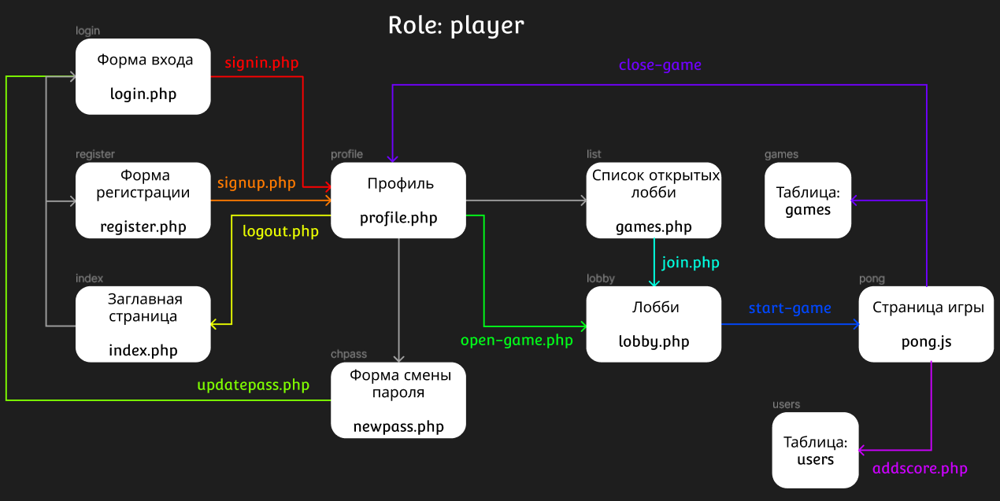
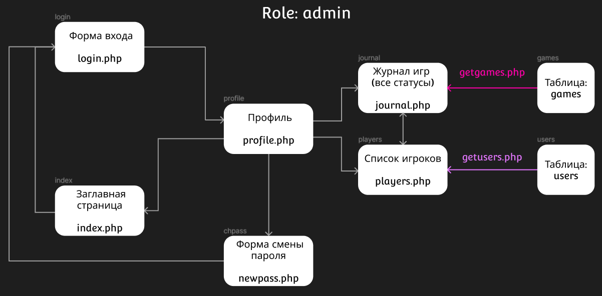

# Информационная система: "Лобби для онлайн игр"
## Техническое задание 
### Краткое описание ИС
Информационная система должна представлять собой веб-приложение в котором, после регистрации, пользователю будет предложено принять участие в игре "Pong". Пользователь может, как присоединиться к открытому лобби, так и создать своё. После, по готовности пользователей начинается игра, где побеждает игрок, набравший наибольшее количество очков.

Помимо стандартного аккаунта игрока, будет учётная запись админа, который не может принимать участия в играх, но имеет доступ к журналу всех игровых сессий и зарегистрированных пользователей.
### Описание пользовательского интерфейса

-----

-----
### Пользовательские сценарии
 - Пользователь создаёт учётную запись в системе (пользоатели без учётной записи не могут играть).
 - В профиле, пользователь либо подключается к активному лобби, либо создаёт своё и ожидает второго игрока.
 - По готовности пользователей начинается игра, и завершается, когда один из игроков набирает N-ое число очков раньше второго.
 - По окончании игры обоим игрокам начисляются очки и они возвращаются в свои профили.
### Архитектура системы

**API сервера**

User:
 - Register
 - Login
 - Logout
 - Addscore
 - Getusers
 - Delete
 - Updpassword

Game:
 - Open
 - Close
 - Join
 - Getgames

**Описание базы данных:**

Таблица: "games"

| id  | status       | initiator    |
| --- | ------------ | ------------ |
| int | varchar(256) | varchar(256) |

Таблица: "users"

| id  | role         | nick         | login        | pass         | score | games_played |
| --- | ------------ | ------------ | ------------ | ------------ | ----- | ------------ |
| int | varchar(256) | varchar(256) | varchar(256) | varchar(256) | int   |  int         |

## Документация

[API сервера](swagger.yaml)

**Развёртывание**

